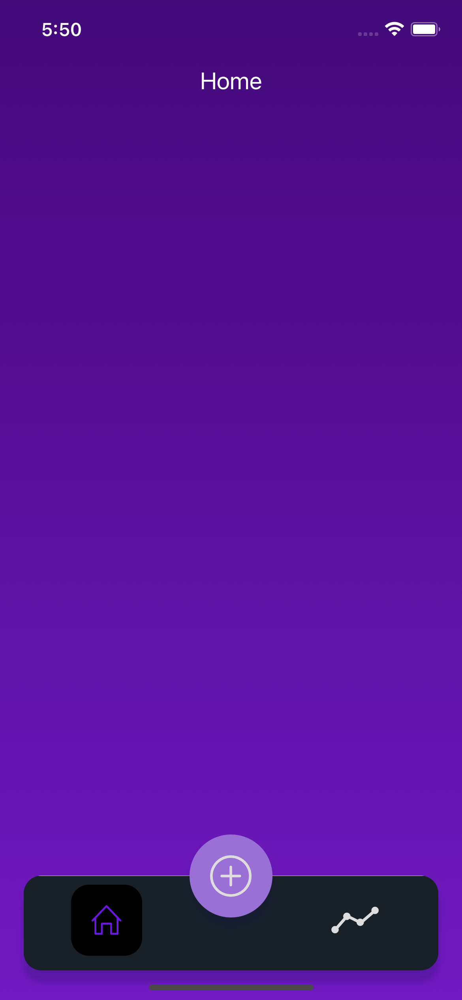
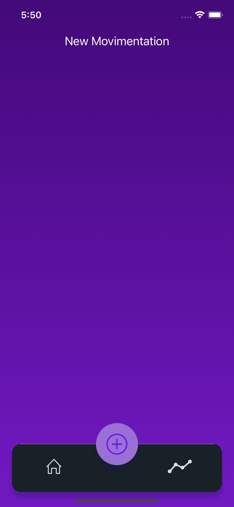
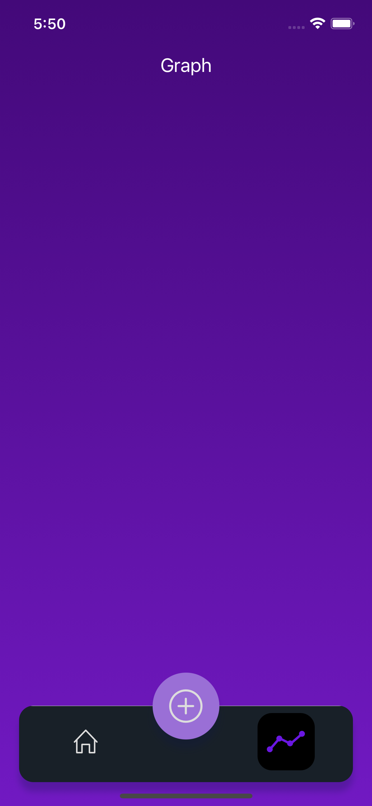

# MyFinancial

React Native application with libraries React Native Navigation Bottom Tabs, Vector Icons and Linear Gradient using typescript.

# Application









## Installation
Download and install [Nodejs](https://nodejs.org/en/).

Download code and run [yarn](https://yarnpkg.com/) or [npm](https://www.npmjs.com) install in the root to install the dependences.

```bash
yarn
```
```bash
npm install
```

Go to IOS folder and run [Pod](https://cocoapods.org) install.
```bash
cd iOS && pod install && cd ..
```

## Usage

Go to root folder and run yarn ios for Iphone emulator and yarn android for Android emulator.

```node
yarn ios
```

```bash
yarn android
```

## Create By
[Francisco Correia](https://www.linkedin.com/in/francisco-correia-a09143134/)